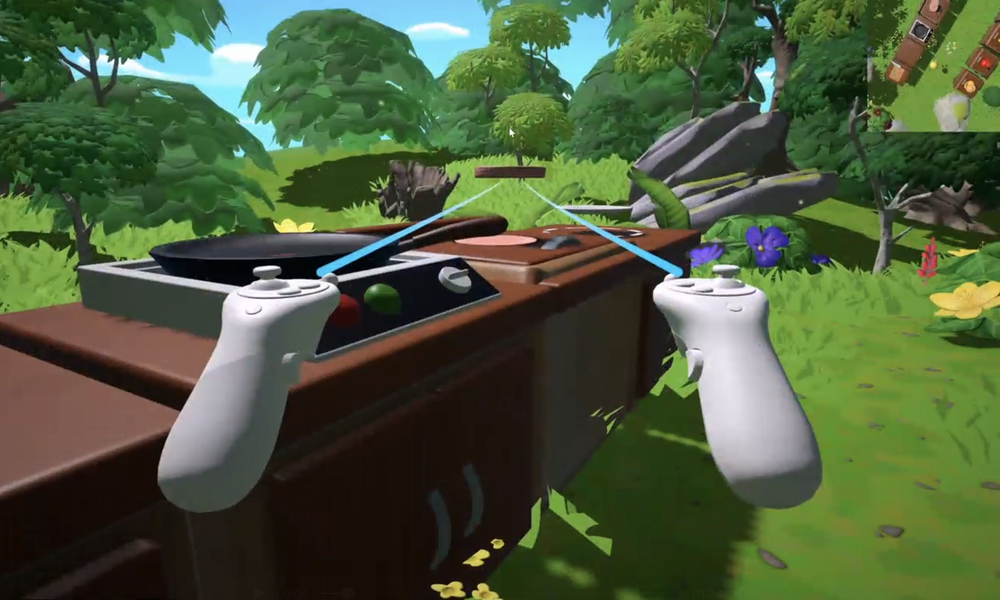

# 👨‍🍳 Overcooked VR

**Overcooked VR** is a VR adaptation of the classic co-op game *Overcooked*, built with the Unity engine. This project delivers an immersive kitchen experience where players can interact directly with food, tools, and appliances using VR controls in a first-person perspective.



---

## 🔑 Key Features

### Immersive VR Cooking Experience  
- First-person VR simulation of a fully functional kitchen  
- Players grab, cut, cook, and serve food just like in a real kitchen  
- Faithful reimagining of *Overcooked* gameplay in VR

### Full VR Interaction System  
- Built with **Unity XR Interaction Toolkit**  
- Supports:
  - Physical grabbing & throwing  
  - Food cutting mechanics  
  - Intuitive ray-based interactions for menu selection & button activation

### Realistic Food Processing Pipeline  
- Ingredients support different physical states (raw / sliced / cooked)  
- Visual and interaction logic changes based on ingredient state  
- Enhances realism and tactile feedback
---

## 🚀 Requirements

- **Unity 2021+** (URP-enabled)  
- Recommended: RTX GPU, 16GB+ RAM

---


## 🛠️ Getting Started

```bash
# Clone this repository
git clone https://github.com/your-name/OvercookedVR.git

# Open the project with Unity Hub